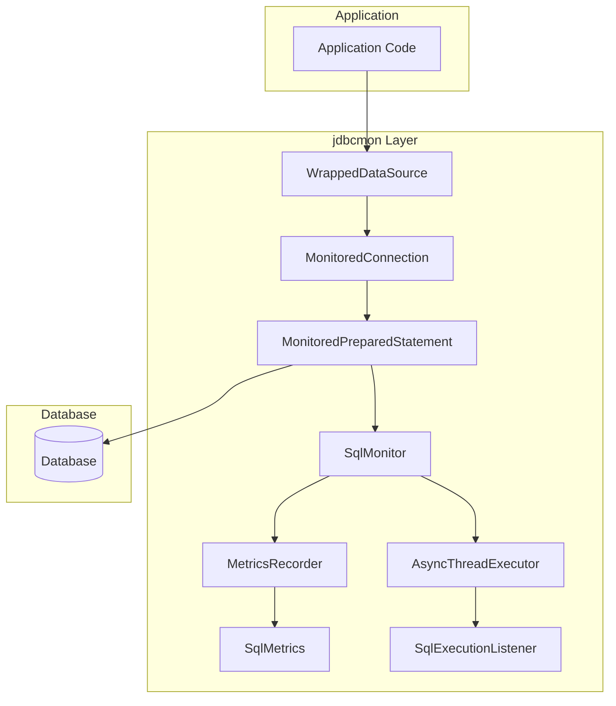
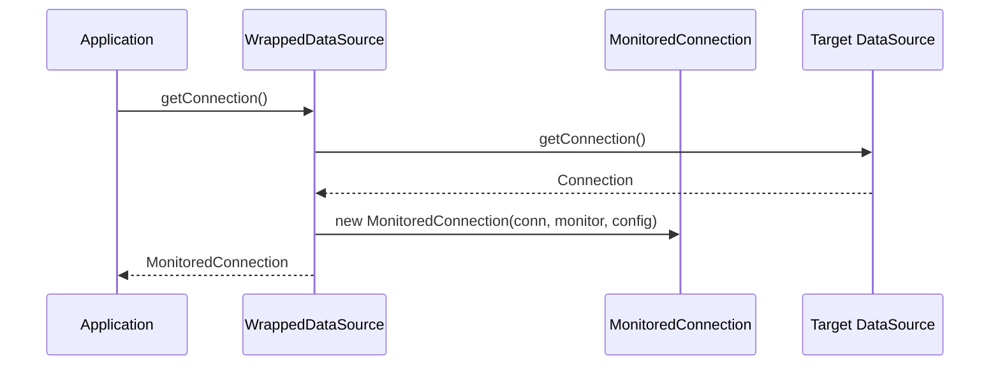
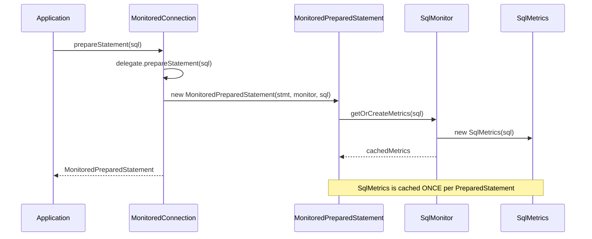
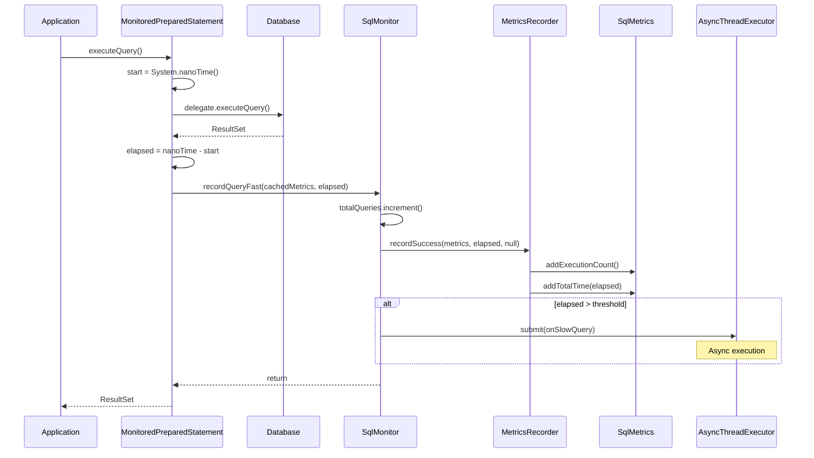
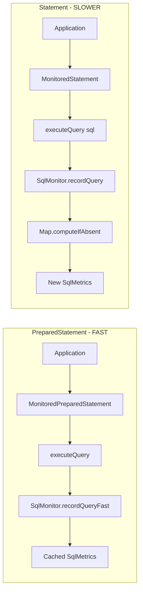
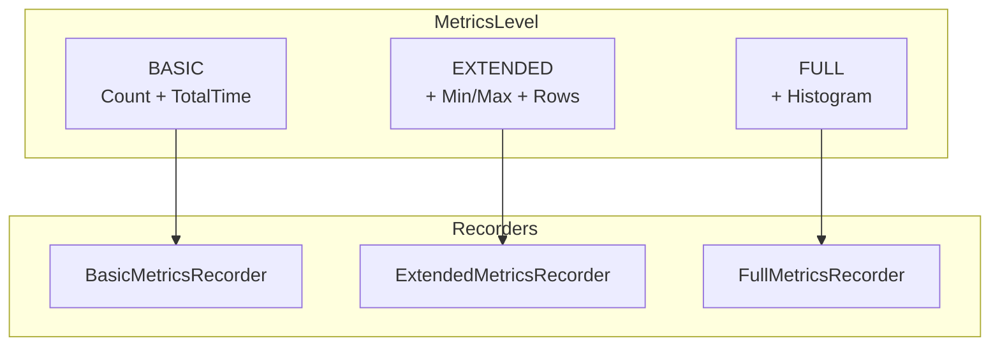
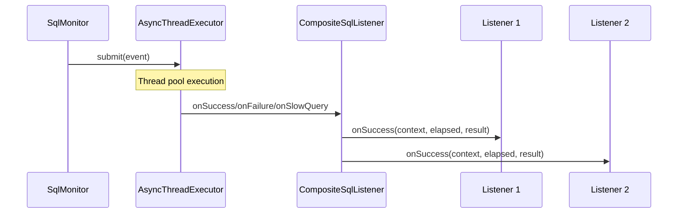
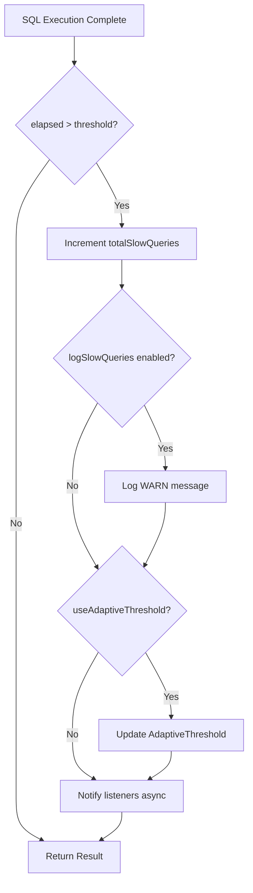
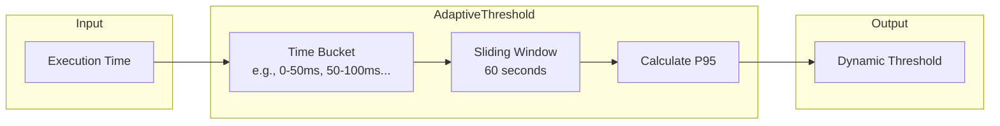

# JDBC Monitoring Core Data Flow

## Overview

The jdbcmon framework intercepts JDBC calls through wrapper classes and records performance metrics asynchronously. This document describes the data flow from application to database and back through the monitoring layer.

## High-Level Architecture

## Connection Acquisition Flow

## PreparedStatement Creation Flow

## Query Execution Flow (Fast Path)

## Statement vs PreparedStatement Flow

**Key Difference:**
- **PreparedStatement**: SqlMetrics is cached at creation time, avoiding Map lookup on each execution
- **Statement**: Must perform Map lookup (`computeIfAbsent`) on every execution since SQL is dynamic

## Metrics Recording Strategy

| Level | Overhead | Features |
|-------|----------|----------|
| BASIC | ~1% | Execution count, total time |
| EXTENDED | ~3% | + Min/max time, rows affected |
| FULL | ~5% | + Time histogram for percentiles |

## Async Event Notification

**Important:** All listener callbacks are executed asynchronously to avoid blocking the application thread.

## Slow Query Detection

## Adaptive Threshold Algorithm

The adaptive threshold:
1. Buckets execution times into ranges
2. Maintains counts per bucket over a sliding window
3. Calculates the configured percentile (default P95)
4. Returns dynamic threshold for slow query detection