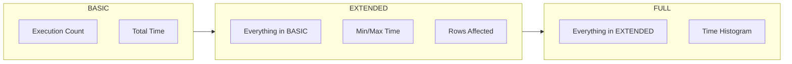

# config Package Design

## Overview

The `config` package provides configuration classes for the jdbcmon framework using the Builder pattern.

## Classes

### WrappedConfig

**Purpose:** Holds all configuration options for monitoring behavior.

**Design:**
- Immutable after construction
- Builder pattern for fluent configuration
- Sensible defaults for all options

**Configuration Categories:**

#### Monitoring Settings
| Field | Type | Default | Description |
|-------|------|---------|-------------|
| `enableMonitoring` | boolean | true | Enable/disable monitoring |
| `metricsLevel` | MetricsLevel | BASIC | Level of detail for metrics |
| `slowQueryThresholdMs` | long | 1000 | Slow query threshold in milliseconds |

#### Adaptive Threshold Settings
| Field | Type | Default | Description |
|-------|------|---------|-------------|
| `useAdaptiveThreshold` | boolean | true | Use dynamic threshold |
| `adaptivePercentile` | double | 95.0 | Percentile for threshold |
| `adaptiveWindowSizeSeconds` | int | 60 | Sliding window size |

#### Thread Pool Settings
| Field | Type | Default | Description |
|-------|------|---------|-------------|
| `corePoolSize` | int | CPU/2 | Core thread pool size |
| `maxPoolSize` | int | CPU | Maximum thread pool size |
| `queueCapacity` | int | 1000 | Task queue capacity |

#### Logging Settings
| Field | Type | Default | Description |
|-------|------|---------|-------------|
| `enableLogging` | boolean | true | Enable event logging |
| `logSlowQueries` | boolean | true | Log slow query warnings |
| `logParameters` | boolean | false | Log SQL parameters (security risk) |
| `collectStackTrace` | boolean | false | Collect stack traces for slow queries |

#### Filter Settings
| Field | Type | Default | Description |
|-------|------|---------|-------------|
| `excludedTables` | Set&lt;String&gt; | empty | Tables to exclude from monitoring |
| `excludedSchemas` | Set&lt;String&gt; | empty | Schemas to exclude |
| `sqlPatternFilter` | Pattern | null | Regex pattern for SQL filtering |

**Builder Pattern:**

```java
WrappedConfig config = new WrappedConfig.Builder()
    .metricsLevel(MetricsLevel.EXTENDED)
    .slowQueryThresholdMs(500)
    .useAdaptiveThreshold(true)
    .adaptivePercentile(95.0)
    .threadPool(4, 8, 500)
    .logSlowQueries(true)
    .addExcludedTable("sys_config")
    .build();
```

**Implementation:**

```java
public final class WrappedConfig {
    private MetricsLevel metricsLevel = MetricsLevel.BASIC;
    private long slowQueryThresholdMs = 1000;
    // ... other fields
    
    private WrappedConfig() {
        // Private constructor - use Builder
    }
    
    public static class Builder {
        private final WrappedConfig config = new WrappedConfig();
        
        public Builder slowQueryThresholdMs(long threshold) {
            config.slowQueryThresholdMs = threshold;
            return this;
        }
        
        public WrappedConfig build() {
            return config;
        }
    }
}
```

### MetricsLevel (Enum)

**Purpose:** Defines monitoring granularity levels.

**Values:**



| Level | Records | Use Case | Overhead |
|-------|---------|----------|----------|
| BASIC | Count, TotalTime | Production | ~1% |
| EXTENDED | + Min, Max, Rows | Production with more detail | ~3% |
| FULL | + Histogram | Development/Testing | ~5% |

**Usage:**

```java
// Runtime adjustment
sqlMonitor.setMetricsLevel(MetricsLevel.EXTENDED);
```

## Design Patterns Used

### Builder Pattern

```mermaid
classDiagram
    class WrappedConfig {
        -metricsLevel: MetricsLevel
        -slowQueryThresholdMs: long
        +getMetricsLevel()
        +getSlowQueryThresholdMs()
    }
    
    class Builder {
        -config: WrappedConfig
        +metricsLevel(MetricsLevel): Builder
        +slowQueryThresholdMs(long): Builder
        +build(): WrappedConfig
    }
    
    WrappedConfig +-- Builder
```

**Benefits:**
- Fluent API for configuration
- Immutable result
- Defaults applied automatically
- Validation can be added in `build()`

### Constants Pattern

Default values are defined in `JdbcConsts`:

```java
public final class JdbcConsts {
    public static final long DEFAULT_SLOW_QUERY_THRESHOLD_MS = 1000L;
    public static final int DEFAULT_CORE_POOL_SIZE = 0;  // 0 = auto (CPU/2)
    public static final int DEFAULT_MAX_POOL_SIZE = 0;   // 0 = auto (CPU)
    public static final int DEFAULT_QUEUE_CAPACITY = 1000;
    public static final double ADAPTIVE_PERCENTILE = 95.0;
    public static final int ADAPTIVE_WINDOW_SIZE_SECONDS = 60;
}
```

## Configuration Examples

### Production (Minimal Overhead)
```java
WrappedConfig config = new WrappedConfig.Builder()
    .metricsLevel(MetricsLevel.BASIC)
    .slowQueryThresholdMs(2000)
    .logSlowQueries(true)
    .build();
```

### Development (Detailed Analysis)
```java
WrappedConfig config = new WrappedConfig.Builder()
    .metricsLevel(MetricsLevel.FULL)
    .slowQueryThresholdMs(500)
    .useAdaptiveThreshold(true)
    .collectStackTrace(true)
    .build();
```

### High-Volume Production
```java
WrappedConfig config = new WrappedConfig.Builder()
    .metricsLevel(MetricsLevel.BASIC)
    .threadPool(8, 16, 2000)  // Larger pool
    .addExcludedTable("audit_log")  // Exclude high-volume table
    .addExcludedSchema("system")
    .build();
```