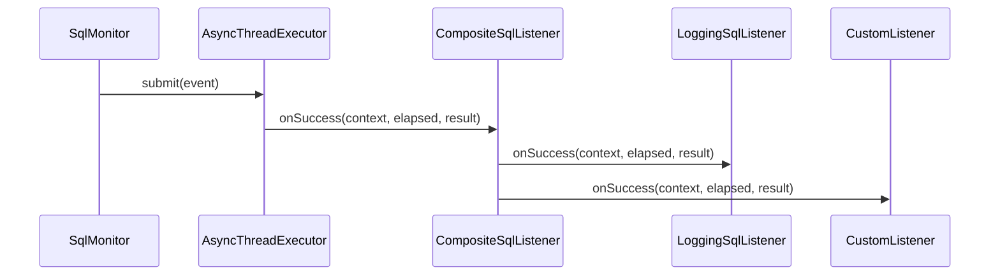
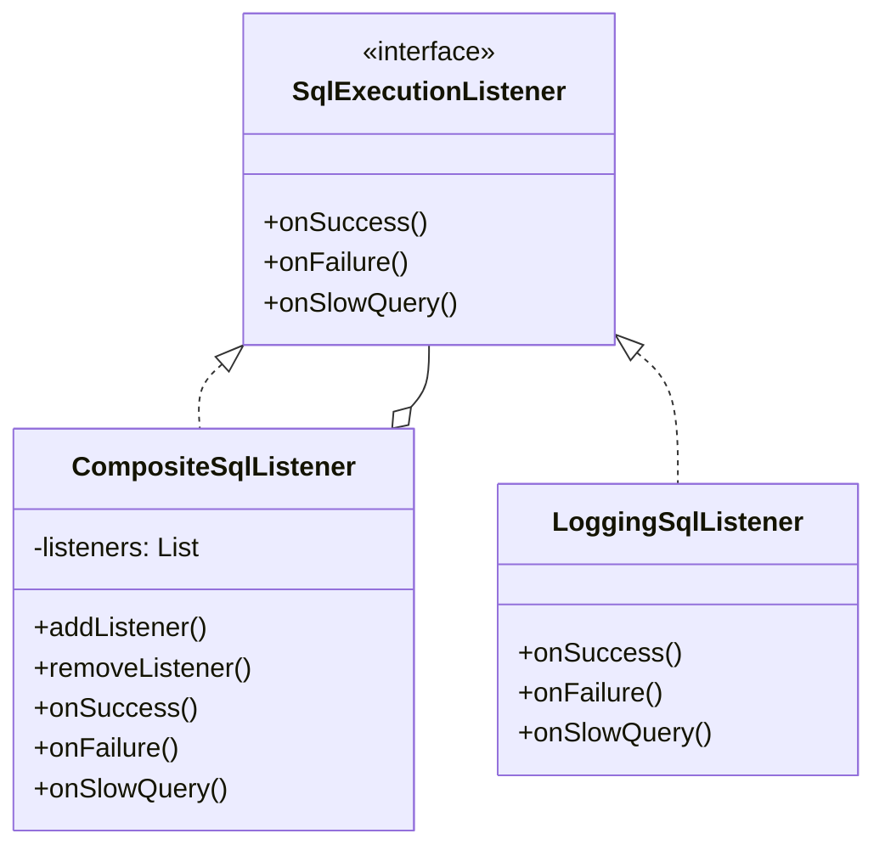

# listener Package Design

## Overview

The `listener` package provides the Observer pattern implementation for async event notification when SQL operations complete.

## Classes

### SqlExecutionListener (Interface)

**Purpose:** Defines callback methods for SQL execution events.

**Methods:**
```java
public interface SqlExecutionListener {
    void onSuccess(SqlExecutionContext context, long elapsedNanos, Object result);
    void onFailure(SqlExecutionContext context, long elapsedNanos, Throwable throwable);
    void onSlowQuery(SqlExecutionContext context, long elapsedMillis);
}
```

**Event Types:**

| Method | When Called | Parameters |
|--------|-------------|------------|
| `onSuccess` | SQL executed successfully | context, elapsed time, result |
| `onFailure` | SQL threw exception | context, elapsed time, exception |
| `onSlowQuery` | Execution exceeded threshold | context, elapsed time |

### CompositeSqlListener

**Purpose:** Manages multiple listeners and broadcasts events to all.

**Design:**
- Implements `SqlExecutionListener` (Composite pattern)
- Maintains list of registered listeners
- Broadcasts each event to all listeners

**Key Methods:**
```java
public void addListener(SqlExecutionListener listener) {
    listeners.add(listener);
}

public void onSuccess(SqlExecutionContext context, long elapsedNanos, Object result) {
    for (SqlExecutionListener listener : listeners) {
        listener.onSuccess(context, elapsedNanos, result);
    }
}
```

### LoggingSqlListener

**Purpose:** Default implementation that logs events via SLF4J.

**Behavior:**
- Logs successful executions at DEBUG level
- Logs failures at WARN level
- Logs slow queries at WARN level

**Example Output:**
```
WARN  [SLOW_SQL] 1523ms (threshold: 1000ms) - SELECT * FROM orders WHERE user_id = ?
WARN  [SQL_ERROR] 234ms - INSERT INTO logs VALUES (?) - SQLException: Duplicate key
DEBUG [SQL_SUCCESS] 45ms - SELECT * FROM users WHERE id = ?
```

## Design Patterns Used

### Observer Pattern



### Composite Pattern



## Usage Example

```java
// Register custom listener
sqlMonitor.addListener(new SqlExecutionListener() {
    @Override
    public void onSuccess(SqlExecutionContext context, long elapsedNanos, Object result) {
        // Send to metrics system
        Metrics.counter("sql.success").increment();
        Metrics.histogram("sql.duration").record(elapsedNanos);
    }
    
    @Override
    public void onFailure(SqlExecutionContext context, long elapsedNanos, Throwable throwable) {
        // Send to error tracking
        ErrorTracker.capture(throwable);
    }
    
    @Override
    public void onSlowQuery(SqlExecutionContext context, long elapsedMillis) {
        // Send alert
        AlertService.notify("Slow query detected: " + context.getSql());
    }
});
```

## Async Execution

**Critical:** All listener methods are called asynchronously via `AsyncThreadExecutor`:

```java
// In SqlMonitor
private void notifyListenersAsync(SqlExecutionContext context, long elapsedNanos, Object result) {
    if (listeners.getListeners().isEmpty()) return;
    
    asyncExecutor.submit(() -> {
        listeners.onSuccess(context, elapsedNanos, result);
    });
}
```

**Benefits:**
- No blocking of application threads
- Listener failures don't affect SQL execution
- High throughput for monitoring events

**Considerations:**
- Listener code should be thread-safe
- Exceptions in listeners are logged but not propagated
- Order of listener notification is not guaranteed