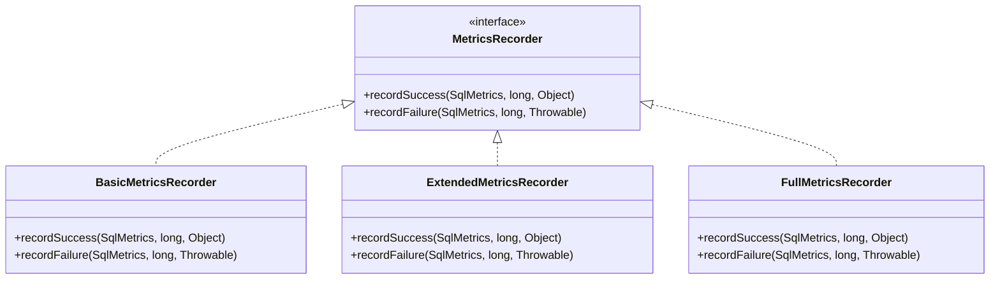
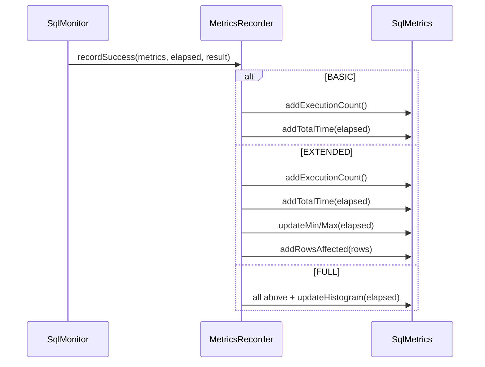

# monitor Package Design

## Overview

The `monitor` package contains the core monitoring logic including metrics collection, storage, and aggregation.

## Classes

### SqlMonitor

**Purpose:** Central coordinator for all monitoring activities.

**Responsibilities:**
- Manages `SqlMetrics` per SQL statement
- Delegates recording to `MetricsRecorder` strategy
- Notifies listeners asynchronously
- Maintains global counters (totalQueries, totalErrors, etc.)
- Implements slow query detection

**Key Fields:**
```java
private final Map<String, SqlMetrics> metricsMap;       // SQL -> Metrics
private final MetricsRecorder recorder;                  // Strategy
private final CompositeSqlListener listeners;            // Observers
private final AsyncThreadExecutor asyncExecutor;         // Async notification
private volatile long slowQueryThresholdNanos;           // Pre-computed threshold
```

**Recording Methods:**

| Method | Purpose | Used By |
|--------|---------|---------|
| `recordQueryFast(metrics, elapsed)` | Fast path with cached metrics | MonitoredPreparedStatement |
| `recordUpdateFast(metrics, elapsed, rows)` | Fast path for updates | MonitoredPreparedStatement |
| `recordErrorFast(metrics, elapsed, throwable)` | Fast path for errors | MonitoredPreparedStatement |
| `recordQuery(sql, elapsed)` | Slow path with Map lookup | MonitoredStatement |

**Slow Query Detection:**
```java
private void checkSlowQueryFast(String sql, long elapsedNanos) {
    if (elapsedNanos > slowQueryThresholdNanos) {
        totalSlowQueries.increment();
        if (logSlowQueries) {
            log.warn("[SLOW_SQL] {}ms - {}", elapsedMillis, sql);
        }
        notifySlowQueryAsync(context, elapsedMillis);
    }
}
```

### SqlMetrics

**Purpose:** Stores metrics for a single SQL statement.

**Design:**
- Thread-safe using `LongAdder` for counters
- Uses `AtomicLong` for min/max comparisons
- Optional histogram for time distribution

**Key Fields:**
```java
private final String sqlKey;
private final LongAdder executionCount = new LongAdder();
private final LongAdder successCount = new LongAdder();
private final LongAdder failureCount = new LongAdder();
private final LongAdder totalTimeNanos = new LongAdder();
private final AtomicLong minTimeNanos = new AtomicLong(Long.MAX_VALUE);
private final AtomicLong maxTimeNanos = new AtomicLong(0);
private final LongAdder rowsAffected = new LongAdder();
```

**Why LongAdder:**
- Better throughput than `AtomicLong` under high contention
- Uses CAS optimizations and striped counters
- Ideal for write-heavy counters

### SqlStatistics

**Purpose:** Snapshot of monitoring statistics for reporting.

**Design:**
- Immutable snapshot taken from `SqlMonitor`
- Contains aggregated totals and top slow queries

**Key Fields:**
```java
private long totalQueries;
private long totalUpdates;
private long totalBatchOps;
private long totalErrors;
private long totalSlowQueries;
private Map<String, SqlMetrics> metricsMap;
private List<SlowQueryInfo> topSlowQueries;
```

### MetricsRecorder (Strategy Interface)

**Purpose:** Strategy pattern for different monitoring levels.

**Hierarchy:**


**Recording Levels:**

| Level | Records | Overhead |
|-------|---------|----------|
| BASIC | Count, TotalTime | ~1% |
| EXTENDED | + Min, Max, Rows | ~3% |
| FULL | + Histogram | ~5% |

**Strategy Selection:**
```java
private MetricsRecorder createRecorder(MetricsLevel level) {
    switch (level) {
        case BASIC: return BasicMetricsRecorder.INSTANCE;
        case EXTENDED: return ExtendedMetricsRecorder.INSTANCE;
        case FULL: default: return FullMetricsRecorder.INSTANCE;
    }
}
```

### AdaptiveThreshold

**Purpose:** Dynamically calculates slow query threshold based on execution history.

**Design:**
- Uses time bucket histogram
- Sliding window (default 60 seconds)
- Calculates P95 (configurable percentile)

**Algorithm:**
1. Bucket execution times into ranges (0-50ms, 50-100ms, etc.)
2. Maintain bucket counts in sliding window
3. Find bucket containing configured percentile
4. Return bucket boundary as threshold

**Key Fields:**
```java
private final long[] timeBuckets;        // Count per time range
private final double percentile;         // e.g., 95.0
private final int windowSizeSeconds;     // e.g., 60
private volatile long currentThreshold;
```

## Design Patterns Used

### Strategy Pattern
`MetricsRecorder` allows different recording behaviors without changing client code.



### Observer Pattern
`SqlExecutionListener` allows external systems to react to SQL events.

## Performance Optimizations

### Pre-computed Threshold
```java
// Avoid TimeUnit conversion on each check
private volatile long slowQueryThresholdNanos;

public SqlMonitor(WrappedConfig config) {
    this.slowQueryThresholdNanos = TimeUnit.MILLISECONDS.toNanos(
        config.getSlowQueryThresholdMs());
}
```

### LongAdder for Counters
```java
// Instead of AtomicLong
private final LongAdder totalQueries = new LongAdder();

public void increment() {
    totalQueries.increment();  // High throughput, low contention
}
```

### Cached Metrics for PreparedStatement
```java
// SqlMonitor
public SqlMetrics getOrCreateMetrics(String sql) {
    return metricsMap.computeIfAbsent(sql, k -> new SqlMetrics(sql));
}

// MonitoredPreparedStatement
private final SqlMetrics cachedMetrics;  // Cached at construction
```

### Async Listener Notification
All listener callbacks are submitted to thread pool, never blocking the application thread:

```java
private void notifyListenersAsync(SqlExecutionContext context, long elapsedNanos, Object result) {
    if (listeners.getListeners().isEmpty()) return;
    
    asyncExecutor.submit(() -> {
        listeners.onSuccess(context, elapsedNanos, result);
    });
}
```