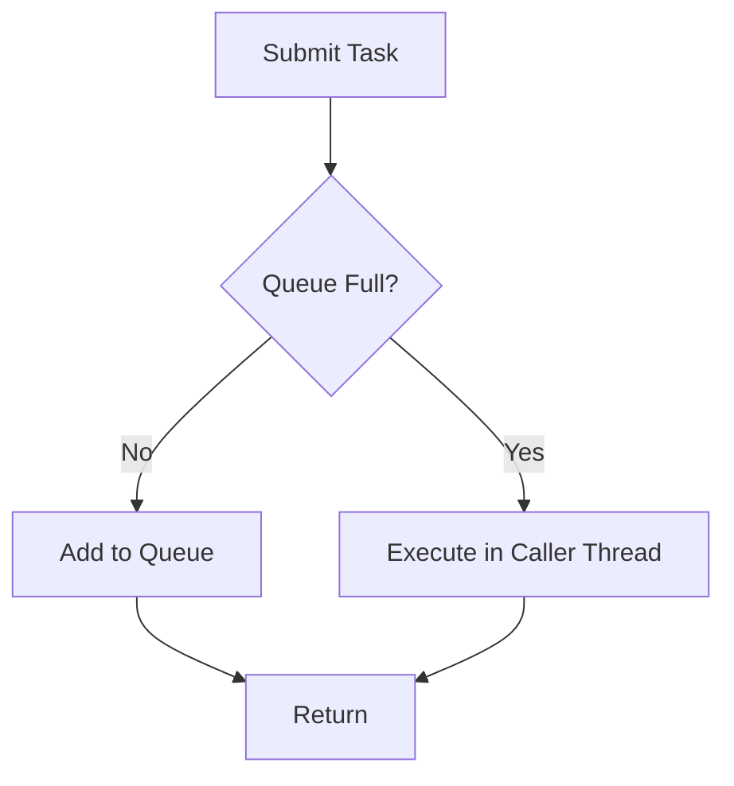
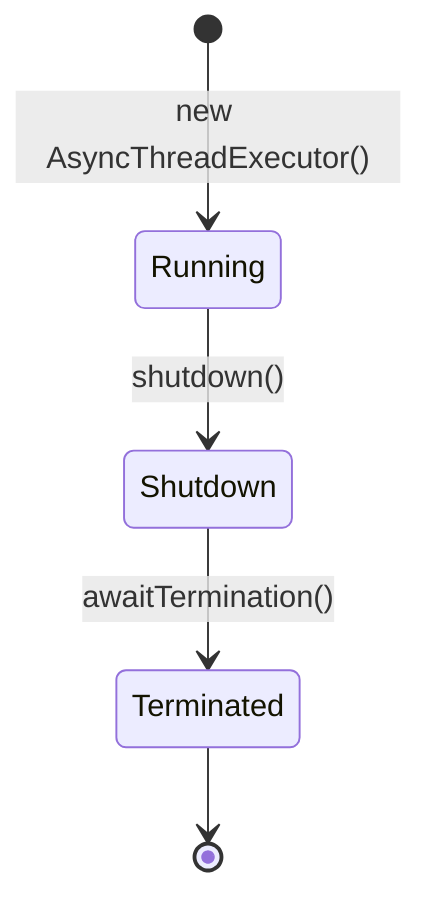

# thread Package Design

## Overview

The `thread` package provides asynchronous execution capabilities for non-blocking event notification.

## Classes

### AsyncThreadExecutor

**Purpose:** Executes listener callbacks asynchronously without blocking application threads.

**Design:**
- Wraps `ThreadPoolExecutor`
- Uses bounded queue to prevent memory issues
- Provides graceful shutdown

**Key Fields:**
```java
private final ThreadPoolExecutor executor;
private volatile boolean shutdown = false;
```

**Configuration:**
```java
public AsyncThreadExecutor(WrappedConfig config) {
    int cpuCores = Runtime.getRuntime().availableProcessors();
    int coreSize = config != null ? config.getCorePoolSize() : Math.max(1, cpuCores / 2);
    int maxSize = config != null ? config.getMaxPoolSize() : cpuCores;
    int queueCapacity = config != null ? config.getQueueCapacity() : 1000;
    
    this.executor = new ThreadPoolExecutor(
        coreSize,           // Core pool size (default: CPU/2)
        maxSize,            // Max pool size (default: CPU)
        60L, TimeUnit.SECONDS,  // Idle thread timeout
        new ArrayBlockingQueue<>(queueCapacity),
        new NamedThreadFactory("jdbcmon-async-" + POOL_COUNTER.incrementAndGet()),
        new ThreadPoolExecutor.CallerRunsPolicy()  // Rejection handler
    );
}
```

**Thread Pool Defaults:**

| Parameter | Default | Configurable |
|-----------|---------|--------------|
| Core Size | CPU cores / 2 | `config.getCorePoolSize()` |
| Max Size | CPU cores | `config.getMaxPoolSize()` |
| Queue Capacity | 1000 | `config.getQueueCapacity()` |
| Keep Alive | 60 seconds | Not configurable |
| Rejection Policy | CallerRunsPolicy | Not configurable |

**Key Methods:**

```java
public void submit(Runnable task) {
    if (shutdown) {
        throw new RejectedExecutionException("Executor has been shutdown");
    }
    executor.submit(task);
}

public void shutdown() {
    shutdown = true;
    executor.shutdown();
    try {
        if (!executor.awaitTermination(5, TimeUnit.SECONDS)) {
            executor.shutdownNow();
        }
    } catch (InterruptedException e) {
        executor.shutdownNow();
        Thread.currentThread().interrupt();
    }
}
```

## Thread Factory

**Purpose:** Creates named daemon threads for easier debugging.

```java
private static class NamedThreadFactory implements ThreadFactory {
    private final AtomicInteger threadNumber = new AtomicInteger(1);
    private final String namePrefix;

    @Override
    public Thread newThread(Runnable r) {
        Thread t = new Thread(r, namePrefix + "-thread-" + threadNumber.getAndIncrement());
        t.setDaemon(true);  // Don't prevent JVM shutdown
        t.setPriority(Thread.NORM_PRIORITY);
        return t;
    }
}
```

**Thread Naming:**
```
jdbcmon-async-1-thread-1
jdbcmon-async-1-thread-2
jdbcmon-async-1-thread-3
```

## Rejection Policy

**CallerRunsPolicy:** When queue is full, the calling thread executes the task.



**Benefits:**
- Never drops events
- Provides backpressure to slow producers
- Simple and reliable

## Lifecycle



**Shutdown Process:**
1. `shutdown()` called
2. New submissions rejected
3. Existing tasks complete
4. Wait up to 5 seconds
5. Force shutdown if needed

## Usage in SqlMonitor

```java
// Initialization
public SqlMonitor(WrappedConfig config) {
    this.asyncExecutor = new AsyncThreadExecutor(config);
}

// Event submission
private void notifyListenersAsync(SqlExecutionContext context, long elapsedNanos, Object result) {
    if (listeners.getListeners().isEmpty()) return;
    
    asyncExecutor.submit(() -> {
        listeners.onSuccess(context, elapsedNanos, result);
    });
}

// Cleanup
public void shutdown() {
    asyncExecutor.shutdown();
}
```