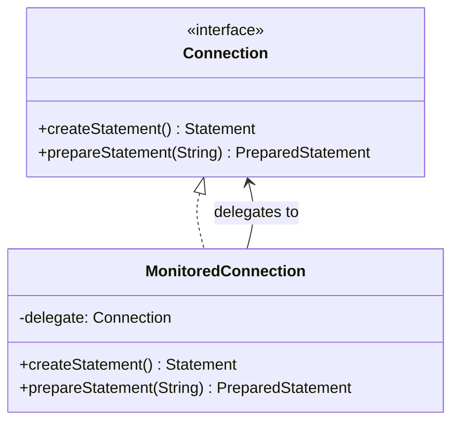
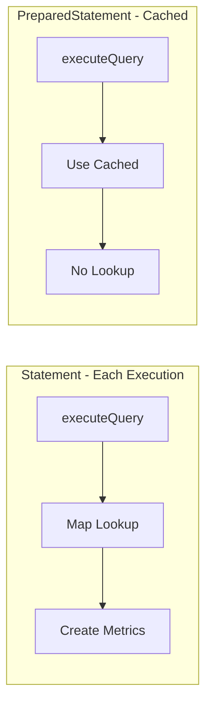

# wrap Package Design

## Overview

The `wrap` package provides the JDBC proxy implementation that intercepts database calls and adds monitoring capabilities without modifying application code.

## Classes

### WrappedDataSource

**Purpose:** Entry point for monitoring. Wraps any `DataSource` and provides monitored connections.

**Design:**
- Implements `DataSource` interface
- Holds reference to target `DataSource` and `SqlMonitor`
- Proxies all `DataSource` methods to target
- Creates `MonitoredConnection` wrappers for returned connections

**Key Methods:**
```java
public Connection getConnection() {
    Connection conn = target.getConnection();
    return wrapConnection(conn);
}

private Connection wrapConnection(Connection conn) {
    return WrappedFactory.wrapConnection(conn, sqlMonitor, config);
}
```

### WrappedFactory

**Purpose:** Static factory for creating monitored JDBC objects. Centralizes wrapper creation logic.

**Design:**
- All methods are static
- No state maintained
- Creates appropriate wrapper based on JDBC type

**Key Methods:**
```java
public static Connection wrapConnection(Connection conn, SqlMonitor monitor, WrappedConfig config)
public static Statement wrapStatement(Statement stmt, SqlMonitor monitor, WrappedConfig config, long parentProxyId)
public static PreparedStatement wrapPreparedStatement(PreparedStatement stmt, String sql, SqlMonitor monitor, WrappedConfig config, long parentProxyId)
```

### MonitoredConnection

**Purpose:** Wraps `Connection` and returns monitored Statement objects.

**Design:**
- Implements `Connection` interface
- Delegates all methods to underlying connection
- Intercepts `createStatement()`, `prepareStatement()`, `prepareCall()` to return monitored versions
- Monitors transaction operations (`commit()`, `rollback()`)

**Monitored Methods:**
| Method | Behavior |
|--------|----------|
| `createStatement()` | Returns `MonitoredStatement` |
| `prepareStatement(sql)` | Returns `MonitoredPreparedStatement` |
| `prepareCall(sql)` | Returns `MonitoredCallableStatement` |
| `commit()` | Records transaction event |
| `rollback()` | Records transaction event |

### MonitoredStatement

**Purpose:** Wraps `Statement` for dynamic SQL execution with monitoring.

**Design:**
- Implements `Statement` interface
- No cached metrics (SQL unknown until execution)
- Uses `monitor.recordQuery(sql, elapsedNanos)` which performs Map lookup

**Performance Note:** Slightly slower than PreparedStatement due to Map lookup on each execution.

**Monitored Methods:**
- `execute(String sql)`
- `executeQuery(String sql)`
- `executeUpdate(String sql)`
- `executeBatch()`

### MonitoredPreparedStatement

**Purpose:** Wraps `PreparedStatement` for pre-compiled SQL with optimized monitoring.

**Design:**
- Implements `PreparedStatement` interface
- **Caches `SqlMetrics`** at construction time
- Uses `monitor.recordQueryFast(cachedMetrics, elapsedNanos)` - no Map lookup

**Performance Optimization:**
```java
public MonitoredPreparedStatement(PreparedStatement delegate, SqlMonitor monitor, String sql) {
    this.delegate = delegate;
    this.monitor = monitor;
    this.sql = sql;
    this.cachedMetrics = monitor.getOrCreateMetrics(sql);  // Cache ONCE
}
```

**Monitored Methods:**
- `execute()` - uses fast path
- `executeQuery()` - uses fast path
- `executeUpdate()` - uses fast path
- `executeBatch()` - uses fast path

### MonitoredCallableStatement

**Purpose:** Wraps `CallableStatement` for stored procedure calls with monitoring.

**Design:**
- Extends `MonitoredPreparedStatement` pattern
- Caches `SqlMetrics` for stored procedure SQL
- Supports all stored procedure parameter types

## Design Patterns Used

### Proxy Pattern
All `MonitoredXxx` classes use the Proxy pattern to intercept JDBC calls.



### Factory Pattern
`WrappedFactory` provides centralized creation of monitored objects.

### Decorator Pattern
Monitoring behavior is added to existing JDBC objects without modifying them.

## Performance Considerations

### PreparedStatement Caching


| Aspect | Statement | PreparedStatement |
|--------|-----------|-------------------|
| Metrics Lookup | Map lookup each time | Cached at creation |
| Performance | Slower | Faster |
| Use Case | Dynamic SQL | Pre-compiled SQL |

### ResultSet Not Monitored
`ResultSet` objects are returned directly without wrapping to minimize overhead. Reading data through a proxy would add significant overhead to every column access.