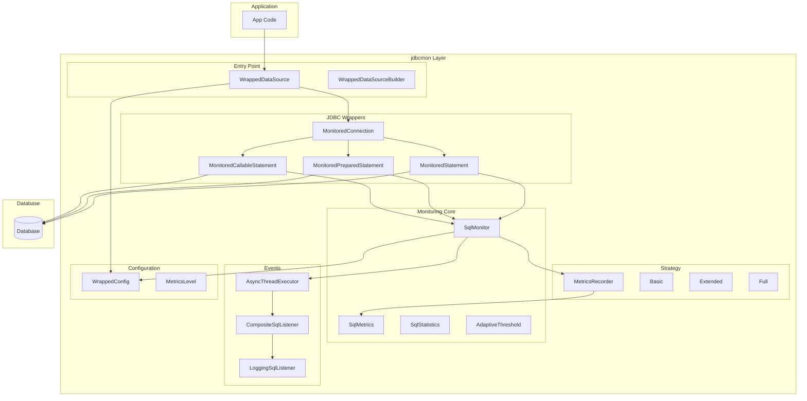
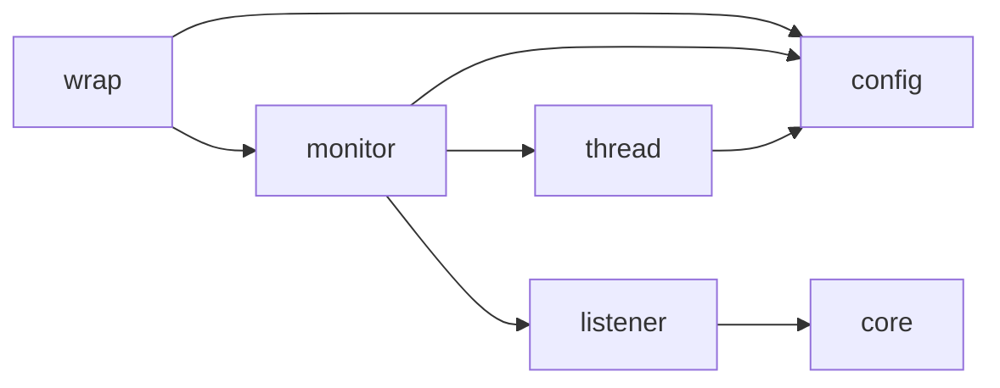
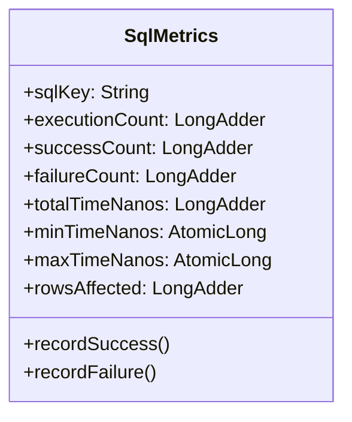
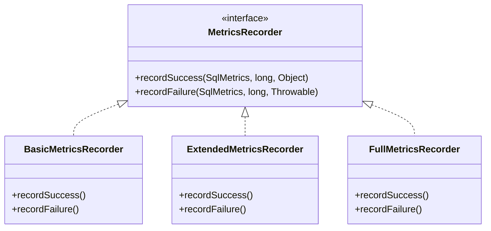
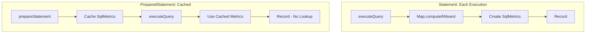
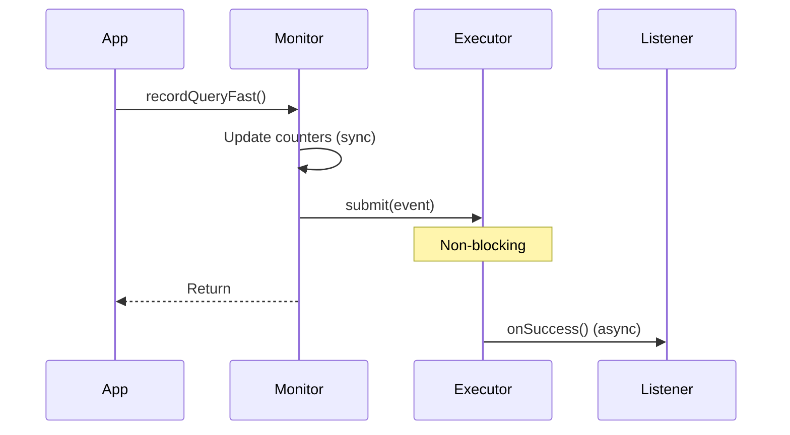
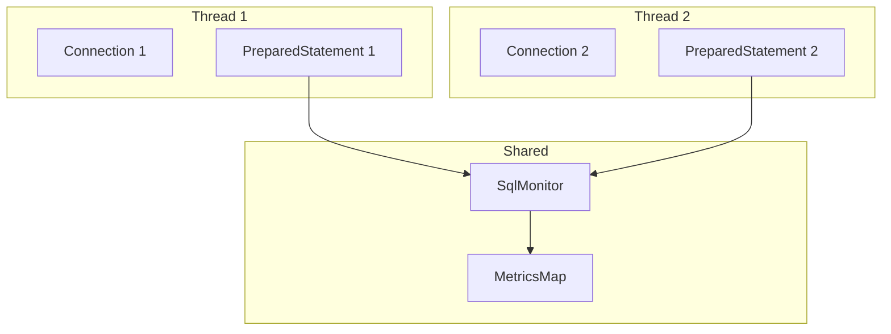
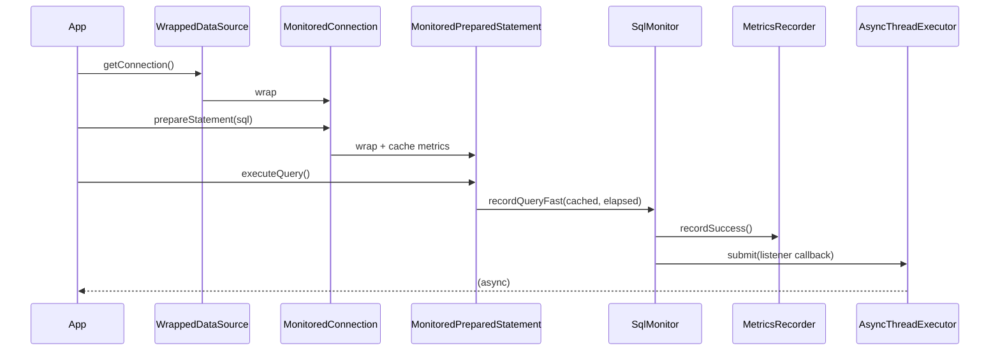

# jdbcmon Global Design

## Project Overview

**jdbcmon** is a high-performance, zero-intrusion JDBC monitoring framework that wraps JDBC objects to provide metrics collection without modifying application code.

## Core Design Principles

### 1. Zero Intrusion
- No code changes required in application
- Wraps existing `DataSource` objects
- Transparent to application code

### 2. High Performance
- Query overhead < 10%
- Update overhead < 15%
- Achieved through:
  - Metrics caching in PreparedStatement
  - Strategy pattern for recording levels
  - Pre-computed thresholds
  - Async event notification

### 3. Extensibility
- Listener interface for custom metrics
- Configurable monitoring levels
- Filter patterns for selective monitoring

## Architecture Overview



## Package Dependencies



## Core Data Structures

### SqlMetrics (Per-SQL Metrics)



### MetricsRecorder (Strategy)



## Key Design Patterns

### 1. Proxy Pattern
All `MonitoredXxx` classes wrap JDBC interfaces.

### 2. Builder Pattern
`WrappedConfig` and `WrappedDataSourceBuilder` provide fluent configuration.

### 3. Strategy Pattern
`MetricsRecorder` allows different recording behaviors.

### 4. Observer Pattern
`SqlExecutionListener` enables event-driven monitoring.

### 5. Composite Pattern
`CompositeSqlListener` manages multiple listeners.

### 6. Factory Pattern
`WrappedFactory` centralizes wrapper creation.

## Performance Optimizations

### PreparedStatement Metrics Caching



### Pre-computed Threshold

```java
// Computed once at construction
slowQueryThresholdNanos = TimeUnit.MILLISECONDS.toNanos(config.getSlowQueryThresholdMs());

// Fast comparison on each execution
if (elapsedNanos > slowQueryThresholdNanos) { ... }
```

### LongAdder for Counters

| Counter Type | Contention | Throughput |
|--------------|------------|------------|
| AtomicLong | High | Low |
| LongAdder | High | High |

### Async Notification



## Thread Safety

### Thread-Safe Components

| Component | Mechanism |
|-----------|-----------|
| SqlMetrics | LongAdder, AtomicLong |
| SqlMonitor | volatile fields, concurrent map |
| WrappedDataSource | Immutable after construction |
| MonitoredXxx | Thread-confined (per-connection) |

### Concurrency Model



- Each `MonitoredConnection` is used by one thread
- `SqlMonitor` is shared but thread-safe
- `SqlMetrics` uses lock-free counters

## Extension Points

### 1. Custom Listener

```java
sqlMonitor.addListener(new SqlExecutionListener() {
    @Override
    public void onSuccess(SqlExecutionContext ctx, long elapsed, Object result) {
        // Custom metrics collection
    }
});
```

### 2. Custom Configuration

```java
WrappedConfig config = new WrappedConfig.Builder()
    .metricsLevel(MetricsLevel.EXTENDED)
    .slowQueryThresholdMs(500)
    .build();
```

### 3. Selective Monitoring

```java
config.addExcludedTable("audit_log")
      .sqlPatternFilter("^(?!SELECT).*");  // Exclude non-SELECT
```

## Performance Targets

| Metric | Target | Achieved (JDK 17) |
|--------|--------|-------------------|
| Query overhead | < 10% | ~5% |
| Update overhead | < 15% | ~5% |
| Batch overhead | < 20% | ~0% |
| Mixed overhead | < 10% | ~-2% |

## Monitoring Flow Summary



## Future Considerations

1. **Connection Pool Integration**: Direct integration with HikariCP, Druid
2. **Metrics Export**: Prometheus, Micrometer integration
3. **Query Analysis**: SQL parsing for table/operation identification
4. **Distributed Tracing**: OpenTelemetry integration